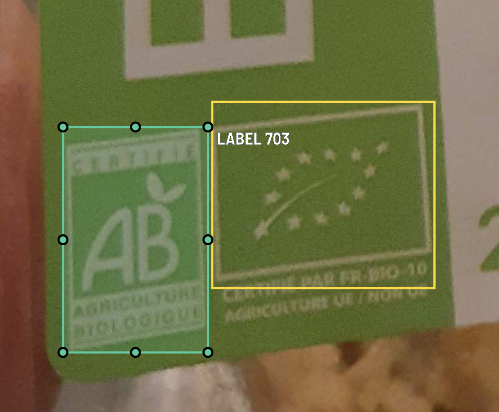
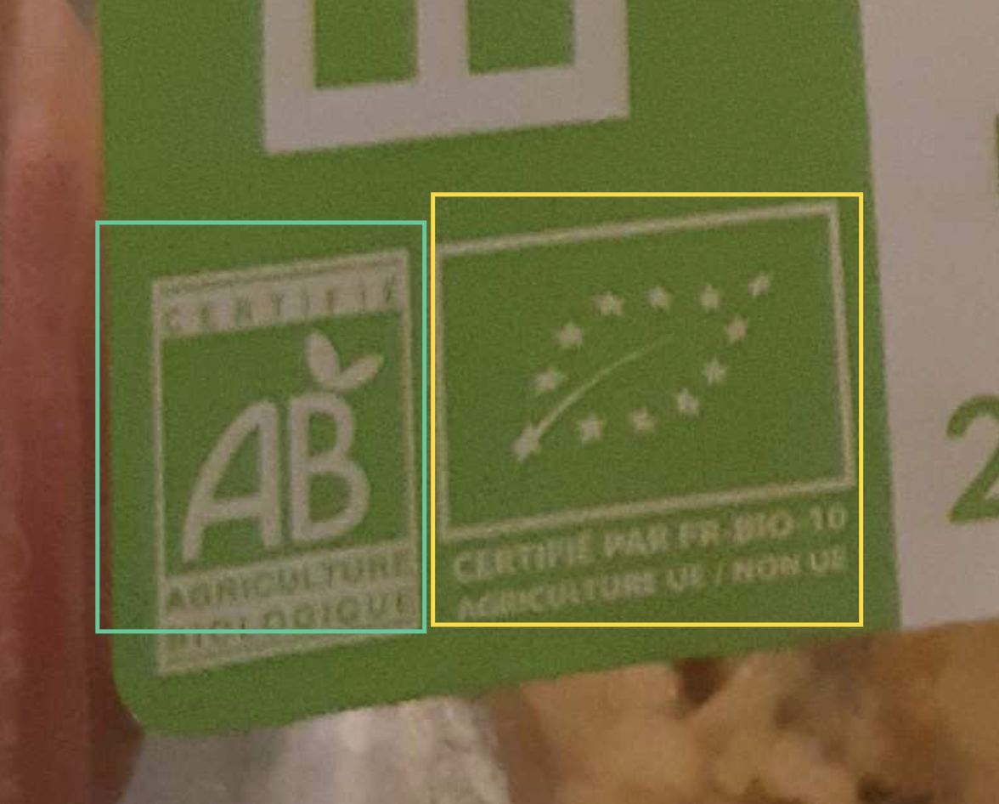
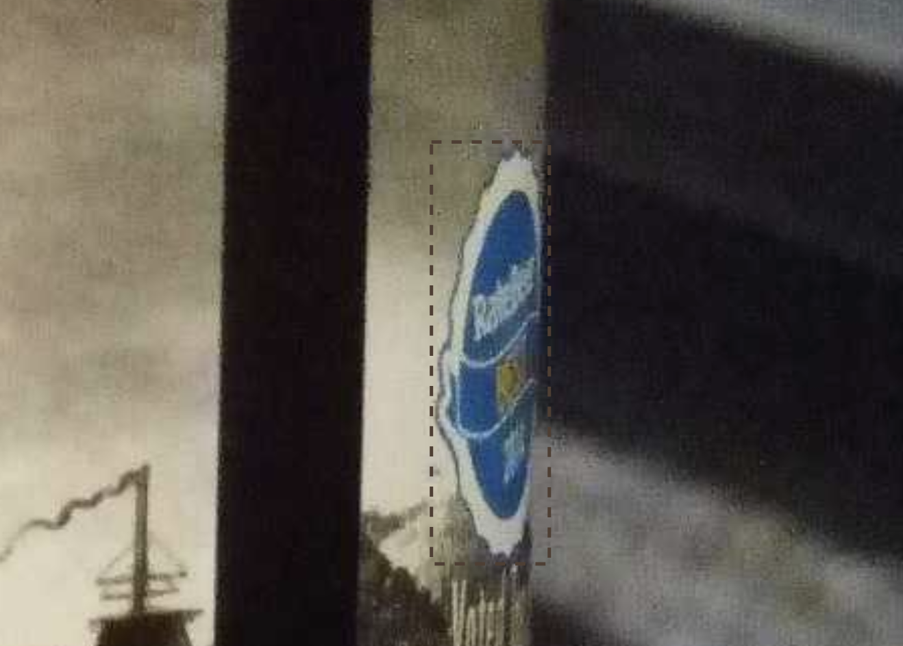
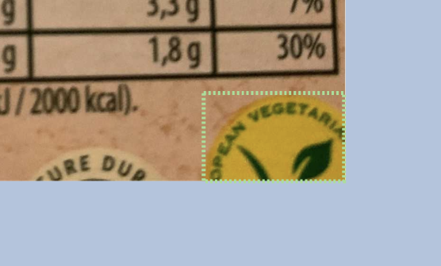

# Label detection Annotation Guidelines

Guidelines on what and how to label.
Adapted from http://host.robots.ox.ac.uk/pascal/VOC/voc2011/guidelines.html

## What to label

All objects of the following categories :
- Labels
- Brands
- QR Code

### Labels
Labels are composed of a small and dense zone (often a circle or a rectangle) with usually one to few colors and sometimes some text within the zone. 

### Brands
Brands are usually one-line text with large printed characters, sometimes using specific fonts.

### QR Codes
Standard scannable QR codes

### Keep in mind
Do not forget that we are trying to develop a generic label/brand detector. No semantic analysis is performed on the label/brand (at least in the first place) , thus you should try to answer the question "Does it __visually__ looks like a label/brand ?"

## How to label

### Bounding box definition

- Mark the bounding box of the visible area of the object (not the estimated total extent of the object).
- The bounding box should contain all visible pixels
-  The bounding box should enclose the object as tight as possible.
- If there is some text nearby the logo and you are wondering if you should include it or not, it is recommended to stick to the logo as the geometrical form (and exclude the text)

_Correct annotation :_

_Incorrect annotation :_

### Occluded information

The label/brand should be marked as occluded if :
- The label/brand is partially cropped
- The label/brand is inclined enough (at your discretion)

_Occluded labels example :_

## FAQ

### My brand is indicated with a logo, what should I do ?

Some brands may be indicated with a logo. In that case, please annotate both (two bounding boxes). It is quite important to annotate everything that looks like a label as a label to enforce the learning process of the model.

### 
