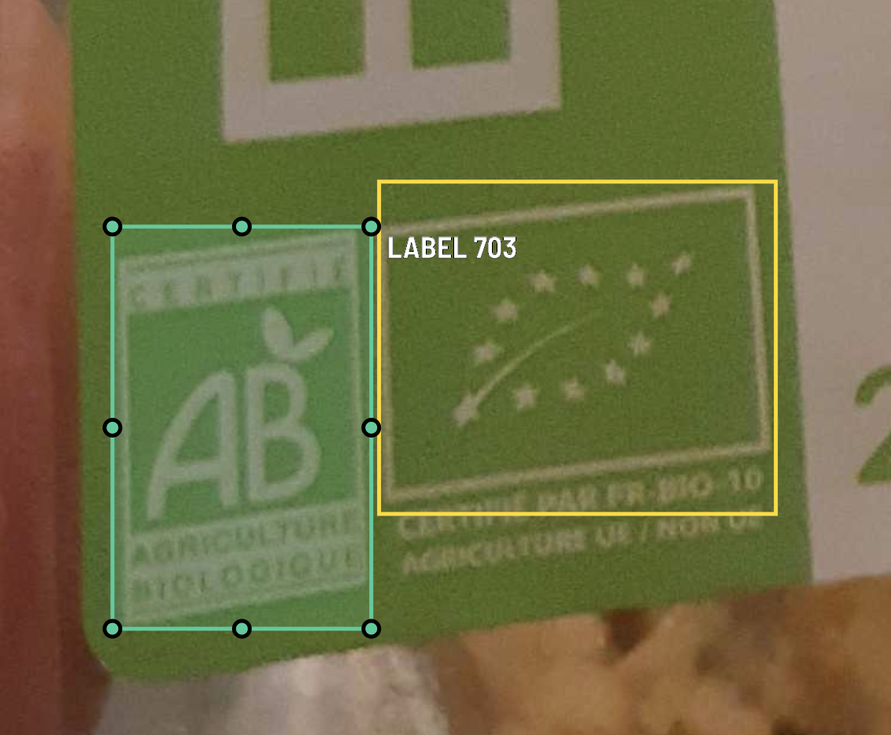
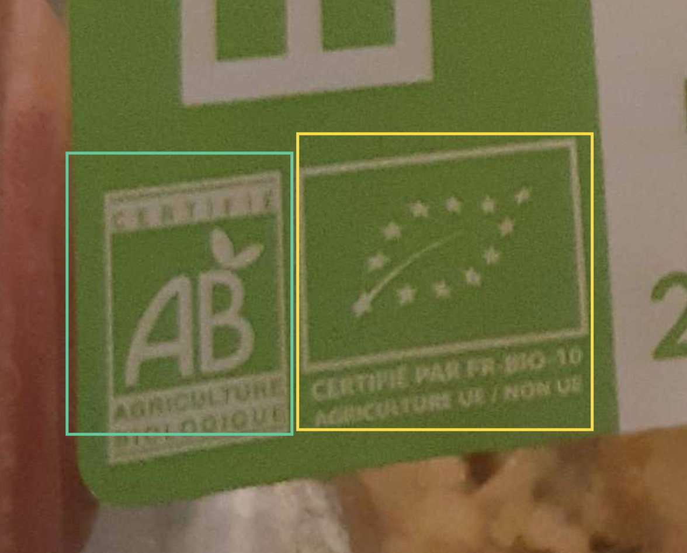
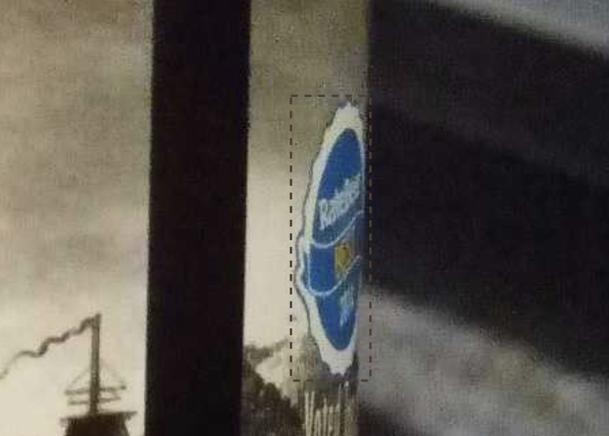
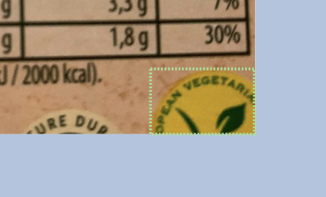

# Logo detection Annotation Guidelines

Guidelines on what and how to label.
Adapted from http://host.robots.ox.ac.uk/pascal/VOC/voc2011/guidelines.html

## What to label

All objects of the following categories :
- logo
- brands

### Logos
Logos are composed of a small and dense zone (often a circle or a rectangle) with usually one to few colors and sometimes some text within the zone. 

### Brands
Brands are usually one-line text with specific fonts.

### Keep in mind
Do not forget that we are trying to develop a generic logo/brand detector. No semantic analysis is performed on the logo/brand (at least in the first place) , thus you should try to answer the question "Does it __visually__ looks like a logo/brand ?"

## How to label

### Bounding box definition

- Mark the bounding box of the visible area of the object (not the estimated total extent of the object).
- The bounding box should contain all visible pixels
-  The bounding box should enclose the object as tight as possible.
- If there is some text nearby the logo and you are wondering if you should include it or not, it is recommended to stick to the logo as the geometrical form (and exclude the text)

Correct annotation :

Incorrect annotation :

### Occluded information

The logo/brand should be marked as occluded if :
- The logo/brand is partially cropped
- The logo/brand is inclined enough (at your discretion)

Occluded logos :

## FAQ

### My brand is indicated with a logo, what should I do ?

Some brands may be indicated with a logo. In that case, please annotate both (two bounding boxes)
